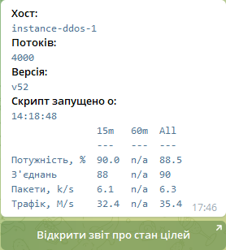
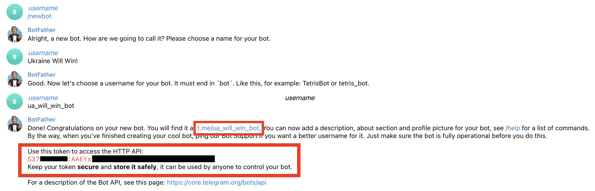
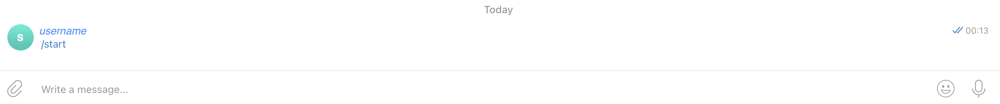
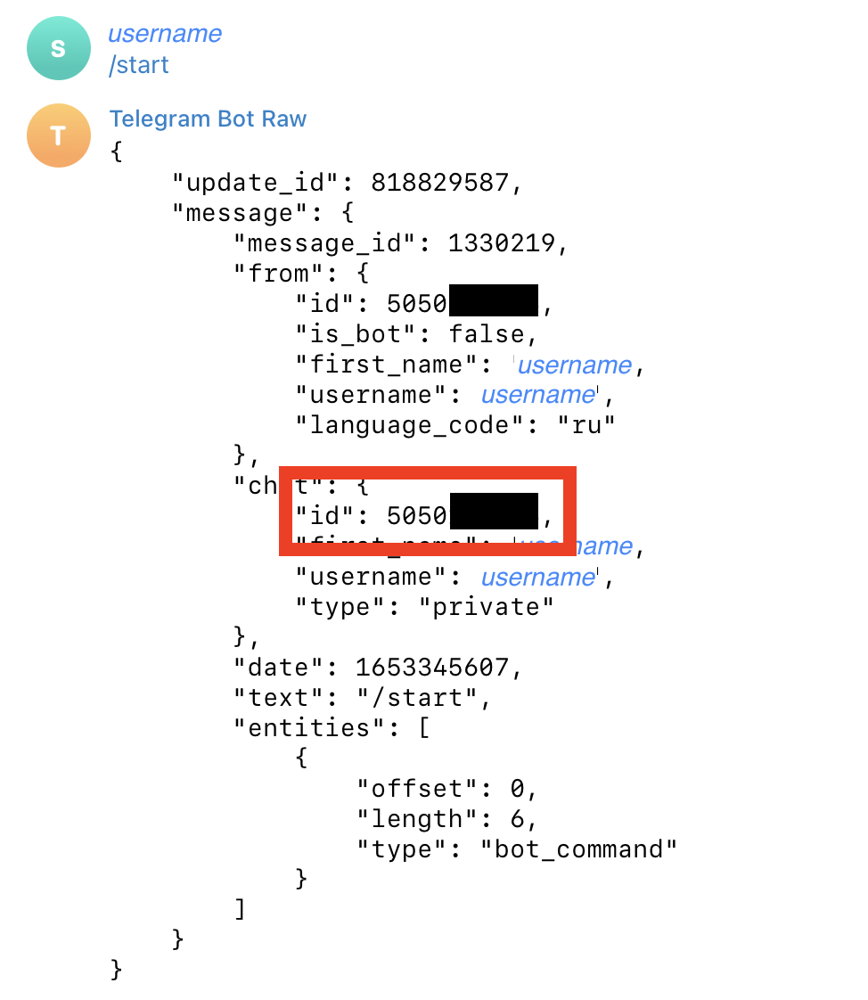
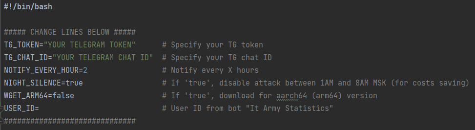

# Встановлювач [mhddos_proxy](https://github.com/porthole-ascend-cinnamon/mhddos_proxy) зі сповіщенням у Telegram

За цією інструкцією ви зможете налаштувати [mhddos_proxy](https://github.com/porthole-ascend-cinnamon/mhddos_proxy) та сповіщення у Телеграм. Це дасть вам змогу зробити це один раз та завжди знати що відбувається на серверах без потреби перевіряти їх кожного дня. Також, це просто красиво ✨

## Як виглядає сповіщення?

## Як встановити?

### Створіть Телеграм бота

Зайдіть у Телеграм та знайдіть бота [BotFather](https://t.me/BotFather). Створіть свого бота за допомогою команди `/newbot` та занотуйте отриманий токен.

Перейдіть до щойно створеного бота та напишіть йому `/start`. Ви не отримаєте відповіді, але це потрібно, щоб його активувати.

### Отримайте Chat ID

Знайдіть бота [RawDataBot](https://t.me/RawDataBot) та напишіть йому `/start`. Занотуйте значення `chat_id`.

### Розгортання коду

Клонуйте код і перейдіть до папки

>git clone https://github.com/sumynik/mhddos_proxy-telegram.git && cd mhddos_proxy-telegram/

Змініть значення згідно інформації яку ви отримали раніше в файлі **mhddos_setup.sh**.

* **TG_TOKEN** - токен отриманий після створення бота
* **TG_CHAT_ID** - отриманий chat_id
* **NOTIFY_EVERY_HOUR** - як часто отримувати нотифікації (кожні Х годин)
* **NIGHT_SILENCE** - виключати атаки між 01:00 - 08:00 МСК (щоб зберегти трохи грошей на трафіку)
* **WGET_ARM64** - завантаження для aarch64 (arm64) версії
* **USER_ID** - ід з [бота](https://itarmy.com.ua/statistics/) для отримання персональної статистики DDOS атаки на русню

Запустіть інсталяційний файл

>/bin/bash mhddos_setup.sh

Вітаю! 🙌 Ви щойно долучились до лав IT Армії!

Чекайте сповіщення у Телеграм згідно розкладу, який ви задали вище.

### Перевірка для нетерплячих 🙂

Зачекайте десь 5 хвилин після створення серверу, потім зайдіть на нього на виконайте `./tg.sh`.

### Корисні посилання

* [Через Docker](https://github.com/sadviq99/mhddos_proxy-setup)